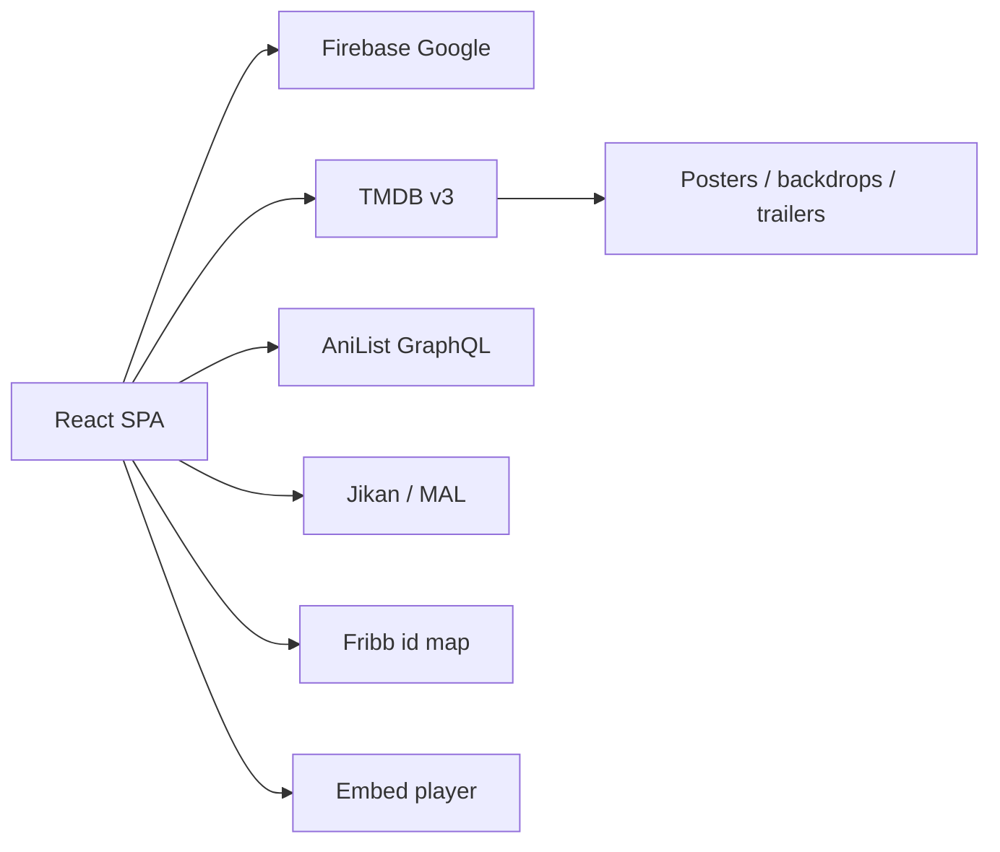

<div align="center">

# miyoro

**a cinematic catalog for movies, series, and anime**

[](https://react.dev)
[](https://vitejs.dev)
[](https://www.typescriptlang.org)
[](https://tailwindcss.com)
[](https://firebase.google.com)

<p>
  Netflix-style home · mixed TMDB + AniList rows · Google sign-in · season / episode watch pages
</p>

</div>

---

Miyoro is a dark, motion-heavy streaming frontend. Metadata comes from **TMDB** (movies / TV) and **AniList** (anime). The UI is built as a Vite SPA with React 19, Tailwind 4, Motion, and Firebase Google auth.

The GitHub repo is `airtv`. The product name in the app is **miyoro**.

## Features

- **Landing** — skewed poster wall (TMDB + AniList), splash, Google sign-in
- **Home** — trailer hero, Top 10, genre rows, and a watch-provider strip (Netflix, Prime, Disney+, Apple TV+, Hulu, Max, Paramount+)
- **Browse** — per-platform grids with movie / TV tabs, powered by TMDB watch-provider IDs
- **Search** — movies, series, anime (or all three interleaved). `Ctrl` / `⌘` + `K` focuses search
- **Watch pages** — movies, TV (`/watch/tv/:id/:season/:episode`), anime (`/anime/:id/:episode`) with season picker and episode list
- **Anime mapping** — AniList details, related seasons, and MAL / TMDB id mapping via Fribb
- **Player** — full-screen play routes with selectable embed backends and local mute preference
- **Auth** — Firebase Google popup, session via `AuthContext`

## Screens & routes

| Route | What you get |
| :--- | :--- |
| `/` | cinematic landing |
| `/home` | hero + catalog rows |
| `/search?q=&filter=` | filtered search grid |
| `/browse/:platform` | provider catalog |
| `/watch/movie/:id` | movie title page |
| `/watch/tv/:id/:season/:episode` | series title + episodes |
| `/anime/:id/:episode` | anime title + episodes |
| `/play/...` | full-screen player |

## Architecture



| Layer | Files |
| :--- | :--- |
| Routes | `src/App.tsx` |
| Pages | `src/pages/` |
| Catalog UI | `src/components/` (`Hero`, `Row`, `Navbar`, episode overlay) |
| Metadata | `src/api/tmdb.ts`, `anilist.ts`, `jikan.ts`, `tvdb.ts`, `fribb.ts` |
| Anime seasons | `src/api/animeRelations.ts`, `animeResolver.ts` |
| Playback URLs | `src/utils/providers.ts` |
| Auth | `src/lib/firebase.ts`, `src/contexts/AuthContext.tsx` |

## Stack

- **React 19** + **React Router 7**
- **Vite 6** + **TypeScript**
- **Tailwind CSS 4** (`@tailwindcss/vite`)
- **Motion** for landing / hero animation
- **Lucide** icons
- **Firebase Auth** (Google)
- **Vercel** SPA rewrites (`vercel.json` → `index.html`)

## Quick start

Needs Node 18+ (npm) or Bun.

```bash
git clone https://github.com/cryoxyl-beep/airtv.git
cd airtv
cp .env.example .env
npm install
npm run dev
```

Dev server: **http://localhost:3000** (`vite --port=3000 --host=0.0.0.0`).

### Scripts

| Command | Action |
| :--- | :--- |
| `npm run dev` | local Vite server |
| `npm run build` | production build |
| `npm run preview` | serve the build |
| `npm run lint` | `tsc --noEmit` |
| `npm run clean` | drop `dist` |

Bun works too (`bun install` / `bun run dev`) — this repo ships a `bun.lock`.

## Environment

Copy `.env.example` and fill Firebase web-app values. Vite only exposes vars prefixed with `VITE_`.

```env
VITE_FIREBASE_API_KEY=
VITE_FIREBASE_AUTH_DOMAIN=
VITE_FIREBASE_PROJECT_ID=
VITE_FIREBASE_STORAGE_BUCKET=
VITE_FIREBASE_MESSAGING_SENDER_ID=
VITE_FIREBASE_APP_ID=
```

In Firebase: enable **Google** sign-in and add `localhost` (and your deploy host) to authorized domains.

TMDB / AniList calls live in `src/api`. Prefer moving any API tokens into env vars instead of leaving them in source.

## Deploy

`vercel.json` rewrites every path to `index.html`, so client-side routes keep working on Vercel.

```bash
npm run build
```

Point the project at this repo and set the same `VITE_*` values in the host’s environment.

## Project layout

```
src/
  api/           TMDB, AniList, Jikan, TVDB, Fribb, anime resolvers
  components/    hero, rows, navbar, player chrome, skeletons
  contexts/      Firebase auth
  pages/         landing, home, search, browse, watch, play
  utils/         embed providers, playback prefs
  lib/           firebase bootstrap
```

One-off `fix_*.cjs` / `patch_*.cjs` files at the repo root are local edit scripts, not part of the runtime app.

## Notes

- Home rows mix Western TMDB results with AniList anime (animation / JP titles are filtered out of the movie/TV feeds so they don’t double up).
- Scroll position is restored when you leave a row and come back.
- This is a catalog + player UI. Respect TMDB, AniList, and the rights of whatever you play.

---

<div align="center">

built as **miyoro** · shipped as **airtv**

</div>
